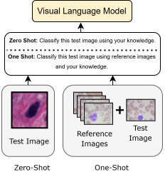

# Cell Classification Benchmarking Toolkit

This repository provides a suite of scripts to evaluate various models on cell image classification tasks. It includes zero‐ and one‐shot evaluation with vision‐enabled large language models, fine‑tuning and evaluation of CNNs (ResNet50 and a custom CNN), and seamless metrics computation.

## Abstract



We benchmark the performance of several approaches on structured cell imaging datasets:

- **Vision‐enabled LLMs**:
  - GPT‑4.1-mini & GPT‑4.1 (OpenAI)
  - Google Gemini 2.5 Pro
  - OpenGVLab InternVL3‑14B
  - LLaVA‑Med (Mistral‑7B)
- **Fine‑tuned CNNs**:
  - Pre‑trained ResNet50 (ImageNet)
  - Custom 3‑layer CNN, adaptive to dataset image size

Each script iterates through multiple datasets (with `TRAIN`, `TEST`, `REFERENCE` subfolders), classifies test images, and computes per‑class and overall metrics (precision, recall, F1, accuracy, Cohen's κ, TP/FP/FN/TN).

## Setup

1. **Clone this repository**:

   ```bash
   git clone https://github.com/yourusername/cell-classification-benchmark.git
   cd cell-classification-benchmark
   ```

2. **Create and activate the conda environment**:

   ```bash
   conda env create -f environment.yml
   conda activate cell-benchmark
   ```

3. **Configure API Keys**:

   - For OpenAI scripts, export your key:
     ```bash
     export OPENAI_API_KEY="sk-..."
     ```
   - For Gemini (Vertex AI), ensure your `gcloud` is authenticated and `PROJECT_ID` and `LOCATION` in the script match your setup.

## Directory Structure

```
├── Data/
│   ├── Dataset1/
│   │   ├── TRAIN/
│   │   │   ├── ClassA/
│   │   │   │   └── img1.png
│   │   │   └── ClassB/...
│   │   ├── TEST/    # multiple images per class
│   │   └── REFERENCE/  # one image per class
│   └── Dataset2/...  # repeat for each dataset
├── environment.yml
├── gpt41mini.py         # GPT‑4.1-mini evaluation
├── gpt41.py             # GPT‑4.1 evaluation
├── internvl.py          # InternVL evaluation
├── gemini25pro.py       # Gemini 2.5 Pro evaluation
├── llava_med.py         # LLaVA‑Med evaluation
├── resnet50_finetune.py # ResNet50 fine‑tuning & evaluation
├── custom_cnn.py        # Custom CNN evaluation
└── README.md            # this file
```

## Usage

### Vision‑Enabled LLMs

```bash
python gpt41mini.py
python gpt41.py
python internvl.py
python gemini25pro.py
python llava_med.py
```

Each script reads datasets under `Data/`, writes results to `results0/` (or configured output directory), and skips already processed datasets.

### Fine‑Tuning and Evaluation

- **ResNet50**:
  ```bash
  python resnet50_finetune.py
  ```
- **Custom CNN**:
  ```bash
  python custom_cnn.py
  ```

Metrics for each dataset are saved as CSV files in the `results0/` directory with per‑class and overall statistics.

## Notes

- Ensure image files are valid (scripts include corrupted‑image filtering).
- Adjust `SHOT` in LLM scripts for zero‑shot (`SHOT=0`) or one‑shot (`SHOT=1`) evaluation.
- For large datasets, consider increasing `session_len` in `TurbomindEngineConfig` to avoid token budget issues.

---

Happy benchmarking! 🚀

